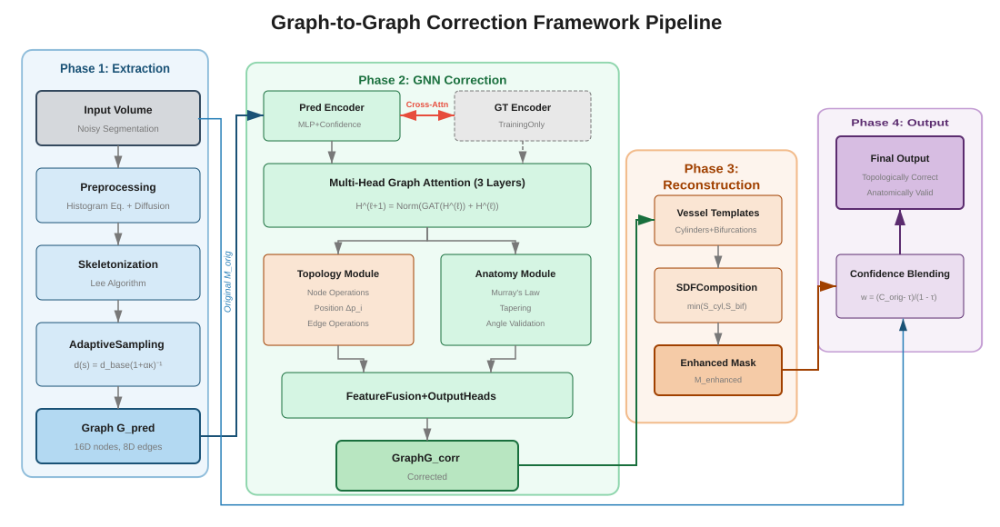

# Graph-to-Graph Correction Framework for Vascular Segmentation

[](https://www.python.org/downloads/)
[](https://pytorch.org/)
[](LICENSE)
[](http://icprai2026.com)

A framework for enhancing vascular segmentation by operating directly on graph representations. This method transforms imperfect deep learning predictions into anatomically and topologically coherent segmentations, achieving a **92% reduction in disconnected components** while improving volumetric accuracy.

> **Accepted at ICPRAI 2026** — 5th International Conference on Pattern Recognition and Artificial Intelligence, Concordia University, Montréal, June 15–18, 2026.

<p align="center">
  
</p>

## Key Features

- **Graph-Space Correction**: Operates on vessel skeleton graphs rather than volumetric data, enabling explicit topology preservation
- **Dual-Module Architecture**: Combines topology correction with anatomy preservation (Murray's Law, vessel tapering)
- **Efficient Design**: 2.3M parameters (30× smaller than volumetric alternatives) with 41-second inference time
- **Clinical Feasibility**: Suitable for real-time interventional planning workflows

## Results Summary

Evaluated on the [PARSE 2022](https://parse2022.grand-challenge.org/) test set (N = 18) — comparison with state-of-the-art methods:

| Method | Dice Score | Components ↓ | Bifurcation F1 | Params |
|--------|------------|--------------|----------------|--------|
| nnU-Net | 0.859 | 76.5 | 0.54 | 31.1 M |
| clDice (Attention U-Net) | 0.780 | 185 | 0.38 | 34.0 M |
| Morphological post-processing | 0.806 | 76.7 | 0.31 | — |
| CRF refinement | 0.694 | 1.0 | 0.07 | — |
| **Ours (Graph-to-Graph)** | **0.874** | **28.1** | **0.87** | **2.3 M** |

All improvements over the baseline reach *p* < 0.001 (paired *t*-tests, Bonferroni-corrected) with Cohen's *d* > 2.0 on topological metrics.

## Installation

### Prerequisites
- Python 3.8+
- CUDA 11.3+ (for GPU acceleration)
- PyTorch 2.0+

### Setup

```bash
# Clone the repository
git clone https://github.com/Houssem-Ben-Salem/Graph-to-Graph-Correction-Framework-for-Consistent-Vascular-Segmentation.git
cd Graph-to-Graph-Correction-Framework-for-Consistent-Vascular-Segmentation

# Create virtual environment
python -m venv venv
source venv/bin/activate  # Linux/Mac
# or: venv\Scripts\activate  # Windows

# Install PyTorch (adjust for your CUDA version)
pip install torch torchvision torchaudio --index-url https://download.pytorch.org/whl/cu118

# Install PyTorch Geometric
pip install torch-geometric
pip install pyg-lib torch-scatter torch-sparse torch-cluster torch-spline-conv -f https://data.pyg.org/whl/torch-2.0.0+cu118.html

# Install remaining dependencies
pip install -r requirements.txt
```

## Project Structure

```
├── configs/                      # Configuration files
│   ├── unet_config.yaml         # U-Net training configuration
│   ├── graph_config.yaml        # Graph correction configuration
│   └── enhanced_training_config.yaml
│
├── src/                          # Source code
│   ├── data/                     # Data handling
│   │   ├── loaders/             # PyTorch data loaders
│   │   └── preprocessing/       # Image preprocessing
│   │
│   ├── models/                   # Model architectures
│   │   ├── unet/                # U-Net variants (2D, 3D, Attention)
│   │   ├── graph_extraction/    # Mask → Graph conversion
│   │   ├── graph_correction/    # GNN correction network
│   │   └── reconstruction/      # Graph → Mask conversion
│   │
│   ├── training/                 # Training pipelines
│   │   ├── losses.py            # Loss functions
│   │   ├── synthetic_degradation.py
│   │   └── graph_correction_dataloader.py
│   │
│   └── utils/                    # Utilities
│       ├── metrics.py           # Evaluation metrics
│       └── graph_correspondence.py
│
├── scripts/                      # Executable scripts
│   ├── train_unet.py            # Train U-Net models
│   ├── train_graph_correction.py # Train graph correction
│   ├── generate_predictions.py   # Generate U-Net predictions
│   ├── extract_all_graphs.py    # Extract graph representations
│   └── evaluate_full_pipeline.py # Full pipeline evaluation
│
└── notebooks/                    # Jupyter notebooks for exploration
```

## Quick Start

### 1. Prepare Data

The framework is designed for the [PARSE 2022 dataset](https://parse2022.grand-challenge.org/). Organize your data as:

```
DATASET/
└── Parse_dataset/
    ├── PA000005/
    │   ├── image/
    │   │   └── PA000005.nii.gz
    │   └── label/
    │       └── PA000005.nii.gz
    ├── PA000006/
    └── ...
```

### 2. Train U-Net Baseline

```bash
python scripts/train_unet.py --config configs/unet_config.yaml
```

### 3. Generate U-Net Predictions

```bash
python scripts/generate_predictions.py \
    --model experiments/unet/best_model.pth \
    --output-dir experiments/unet/predictions
```

### 4. Extract Graph Representations

```bash
python scripts/extract_all_graphs.py \
    --predictions-dir experiments/unet/predictions \
    --output-dir extracted_graphs
```

### 5. Train Graph Correction Model

```bash
python scripts/train_graph_correction.py \
    --config configs/graph_config.yaml \
    --graphs-dir extracted_graphs
```

### 6. Evaluate Full Pipeline

```bash
python scripts/evaluate_full_pipeline.py \
    --unet-model experiments/unet/best_model.pth \
    --graph-model experiments/graph_correction/best_model.pth \
    --data-dir DATASET/Parse_dataset
```

## Method Overview

### Phase 1: Graph Extraction
Converts segmentation masks to graph representations via:
1. **Morphological preprocessing**: Cleanup and hole filling
2. **3D Skeletonization**: Lee's algorithm for centerline extraction
3. **Adaptive node placement**: Dense sampling at bifurcations, sparse in straight segments
4. **Attribute extraction**: Radius, curvature, confidence scores

### Phase 2: GNN Correction
Dual-module Graph Attention Network architecture:

- **Topology Correction Module**
  - Node operations (keep/remove/modify)
  - Edge operations (add/remove/keep)
  - Position displacement prediction

- **Anatomy Preservation Module**
  - Murray's Law enforcement: r³_parent = Σr³_children
  - Vessel tapering consistency
  - Branching angle validation

### Phase 3: Reconstruction
Template-based SDF composition:
- Cylindrical vessel templates
- Smooth bifurcation blending
- Confidence-weighted integration with original predictions

## Configuration

### U-Net Configuration (`configs/unet_config.yaml`)

```yaml
model:
  architecture: "AttentionUNet3D"
  features: [32, 64, 128, 256, 512]

training:
  batch_size: 2
  learning_rate: 0.001
  epochs: 200
```

### Graph Correction Configuration (`configs/graph_config.yaml`)

```yaml
graph_network:
  model_type: "HierarchicalGraphCorrector"
  hidden_dim: 256
  num_gnn_layers: 6

  topology_corrector:
    num_heads: 8
    dropout: 0.1

  anatomy_corrector:
    enforce_murrays_law: true
    murrays_exponent: 3.0

training:
  curriculum:
    enabled: true
    stages:
      - name: "synthetic_simple"
        epochs: 50
      - name: "synthetic_complex"
        epochs: 50
      - name: "real_data"
        epochs: 200
```

## Evaluation Metrics

The framework evaluates both volumetric and topological quality:

| Category | Metrics |
|----------|---------|
| Volumetric | Dice Score, Sensitivity, Precision, Hausdorff Distance |
| Topological | Connected Components, Bifurcation F1, Tree Isomorphism |
| Physiological | Murray's Law Compliance, Tapering Consistency, Branching Angles |

## Pre-trained Models

Pre-trained weights are available on [Zenodo](https://doi.org/10.5281/zenodo.17970564):

```bash
# Download pre-trained models
wget https://zenodo.org/record/17970564/files/pretrained_models.zip
unzip pretrained_models.zip -d pretrained/
```

## Citation

If you use this code in your research, please cite:

```bibtex
@inproceedings{bensalem2026graphtograph,
  title     = {Graph-to-Graph Framework for Topologically and Anatomically Coherent Pulmonary Artery Segmentation},
  author    = {Ben Salem, Houssem and Duong, Luc and Coti, Camille},
  booktitle = {Proceedings of the 5th International Conference on Pattern Recognition and Artificial Intelligence (ICPRAI 2026)},
  series    = {Lecture Notes in Computer Science},
  publisher = {Springer},
  address   = {Montr\'eal, Canada},
  year      = {2026}
}
```

## License

This project is licensed under the MIT License - see the [LICENSE](LICENSE) file for details.

## Acknowledgments

- This research was funded by MITACS Globalink and the Programme de soutien aux projets pilotes en santé, Institut itechsanté.
- Dataset: [PARSE 2022 Challenge](https://parse2022.grand-challenge.org/)

## Contact

- **Houssem Ben Salem** — houssem.ben-salem.1@ens.etsmtl.ca
- [ORCID](https://orcid.org/0009-0009-0837-422X)
- École de technologie supérieure (ÉTS), Montréal, Canada
